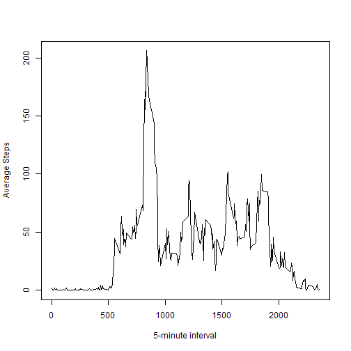

This is a R markdown document.
This document aims at writing a report which analyzes activity monitoring data.


##Loading and preprocessing the data

```r
setwd("E:\\My Document\\DataScience\\ReproducibleAssignment")
unzip("repdata-data-activity.zip")
activity<-read.csv("activity.csv")
```

##What is mean total number of steps taken per day?
1.Calculate the total number of steps taken per day

```r
library(dplyr)
temp<-filter(activity,!is.na(steps))
tempbyDay<-group_by(temp,date)
##TotalstepsPerDay<-tapply(temp$steps,temp$date,sum)
TotalstepsPerDay<-summarize(tempbyDay,totalSteps=sum(steps))
```

2.Make a histogram of the total number of steps taken each day

```r
hist(TotalstepsPerDay$totalSteps,breaks=12,xlab="Total steps taken each day",main="Histogram of Total Steps taken each date")
```

 

3.Calculate and report the mean and median of the total number of steps taken per day

```r
options(digits=7)
meanSteps<-mean(TotalstepsPerDay$totalSteps)
medianSteps<-median(TotalstepsPerDay$totalSteps)
```
The mean of the total numbers of steps taken each day is 1.0766189 &times; 10<sup>4</sup> and the median is 10765

##What is the average daily activity pattern?
1.Make a time series plot  of the 5-minute interval and the average number of steps taken, averaged across all days 

```r
tempbyinterval<-group_by(temp,interval)
averageNum<-summarize(tempbyinterval,avr=mean(steps))
with(averageNum,plot(interval,avr,xlab="5-minute interval",ylab="Average Steps",type="l"))
```

 

2.Find the 5-minute interval, which on average across all the days in the dataset, contains the maximum number of steps

```r
interval<-arrange(averageNum,desc(avr))[1,1]
```
The 5-minute interval which contains the maximum average steps is 835

##Imputing missing values
1.Calculate and report the total number of missing values in the dataset

```r
temp<-activity
num<-sum(apply(activity,1,function(x) any(is.na(x))))
```
The total number of missing values is 2304

2.Fill in all of the missing values in the dataset,use the mean steps for that 5-minute interval.

```r
dataset<-activity
dataset[is.na(dataset),1]<-averageNum[averageNum==dataset[is.na(dataset),3],2]
```
3.Create a new dataset that is equal to the original dataset but with the missing data filled in

```r
dataset<-dataset
```
4.Make a histogram of the total number of steps taken each day and Calculate and report the mean and median total number of steps taken per day

```r
tempbyDay<-group_by(dataset,date)
TotalstepsPerDay<-summarize(tempbyDay,totalSteps=sum(steps))
hist(TotalstepsPerDay$totalSteps,breaks=12,xlab="Total steps taken each day",main="Histogram of Total Steps taken each date")
```

 

```r
meanSteps2<-mean(TotalstepsPerDay$totalSteps)
medianSteps2<-median(TotalstepsPerDay$totalSteps)
```
The mean is 1.0766189 &times; 10<sup>4</sup> and the median is 1.0766189 &times; 10<sup>4</sup>.And the differences are 0 and 1.1886792 respectively.

##Are there differences in activity patterns between weekdays and weekends?
1.Create a new factor variable in the dataset with two levels ¨C ¡°weekday¡± and ¡°weekend¡± indicating whether a given date is a weekday or weekend day.

```r
dataset$date<-as.Date(as.character(dataset$date))
weekend<-c("ÐÇÆÚÁù","ÐÇÆÚÈÕ")
dataset$day<-ifelse(weekdays(dataset$date) %in% weekend,"weekend","weekday")
dataset<-transform(dataset,day=as.factor(day))
```

2.Make a panel plot containing a time series plot  of the 5-minute interval (x-axis) and the average number of steps taken, averaged across all weekday days or weekend days (y-axis). 

```r
library(lattice)
tempbyinterval<-group_by(dataset,interval,day)
averageNum<-summarize(tempbyinterval,avr=mean(steps))
xyplot(avr~interval|day,data=averageNum,layout=c(1,2),type="l",ylab="Number of steps")
```

 
